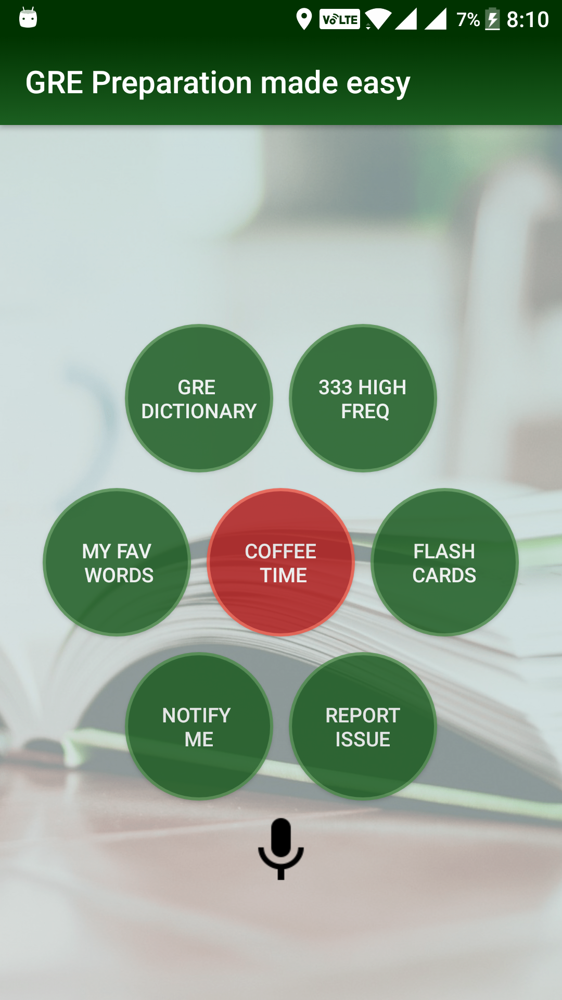
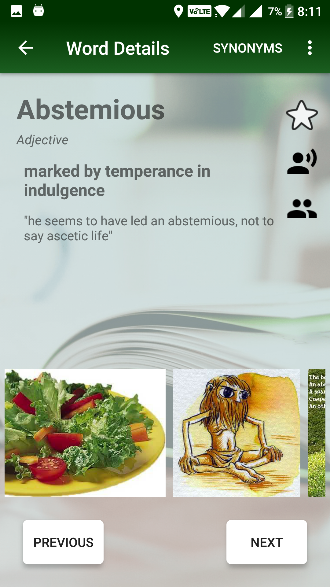
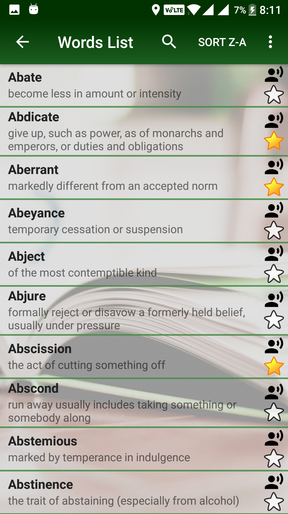
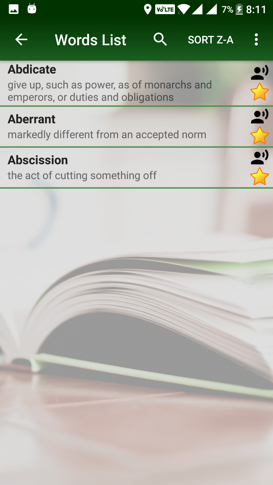
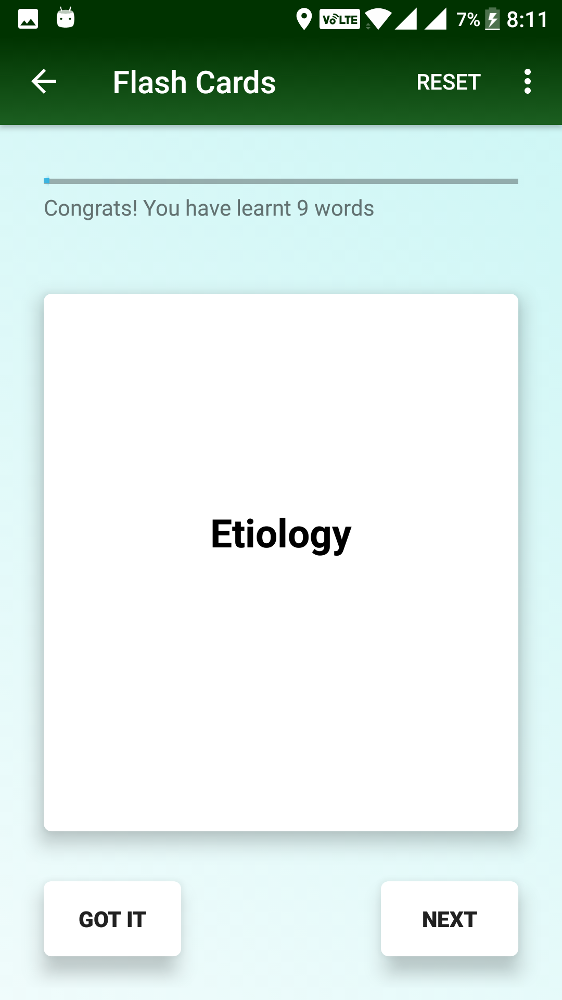
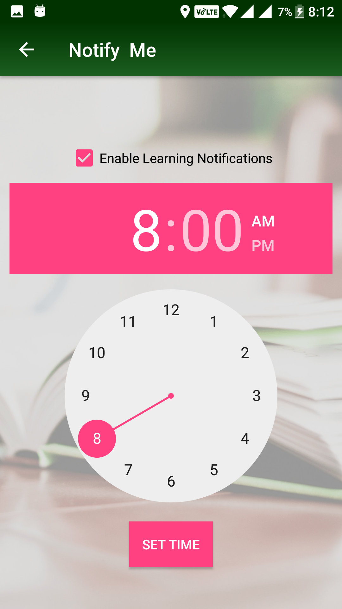
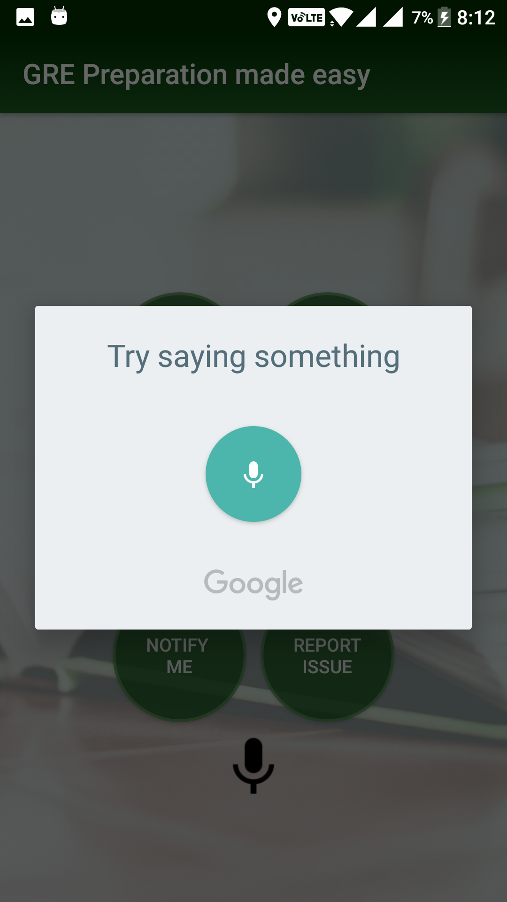

# GRE-Vocabulary-Made-Easy
An android app for GRE aspirants
  
Google play link: [https://play.google.com/store/apps/details?id=com.curiousfreaks.greword&hl=en_US]

This app contains **333 high-frequency and 800 important GRE words**. These are the must word for any GRE aspirant who wants to score well in verbal. Not having irritating ads help to maintain the focus on learning only.  
  
There are flash cards which make learning fun and easy. The user can mark the words as favorite and all those words will available under "Favorite Words".  
  
Another amazing feature is that user can set a time to get a new word notification once in a day. The user can mark the word as learned from the notification only or click the notification to get more information related to the word like the definition, usage, antonyms etc.  
  
GRE Dictionary tab contains more than 800 words that frequently comes in GRE verbal paper.  
  
333 high-frequency words tab contains the words which are most common in the exam. This list contains words from Barron majorly and from other sources like Kaplan, GRE sample test etc.  
  
Favorite words tab contains all the words that user marked as favorite. The user can add and remove the words based on her likings.  
  
Flash Card tab is the same as the classic flash card game to learn the words. Here the user can select if she wants to learn 333 high-frequency words or the GRE 800 words from the top right menu.  
  
Here is the list of features -  
- An amazing GRE preparation app  
- Specially curated 830 words that will be enough to score 160+ in verbal  
- Configurable daily notification having a word of the day to learn a new word every day  
- Dictionary has Barron's 333 words, Barron's 800 high-frequency words and other selected highly useful words  
-  Favorite words list having starred words to ease access to your selected words  
- Search words faster-using google voice search  
- Every word has memes, sentence, synonyms, and antonyms to understand it throughout  
- Speak feature to learn word pronunciation  
- Flashcard for learning with fun  
  
Don't forget to share important words with a friend using the share button. Please let us know your experience with report issue/feedback.

  
   
  
  
  
  
  

## Thank you ##
